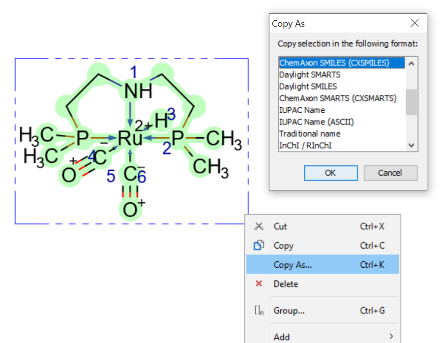
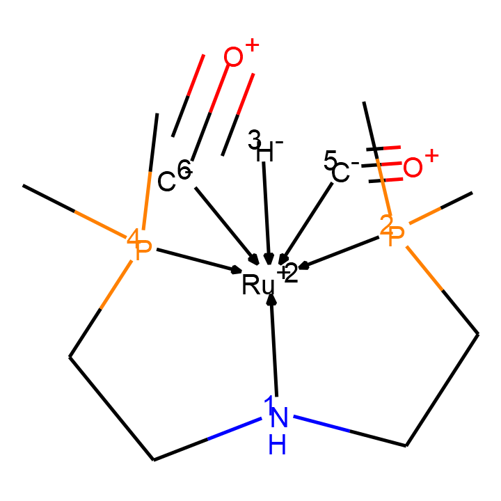
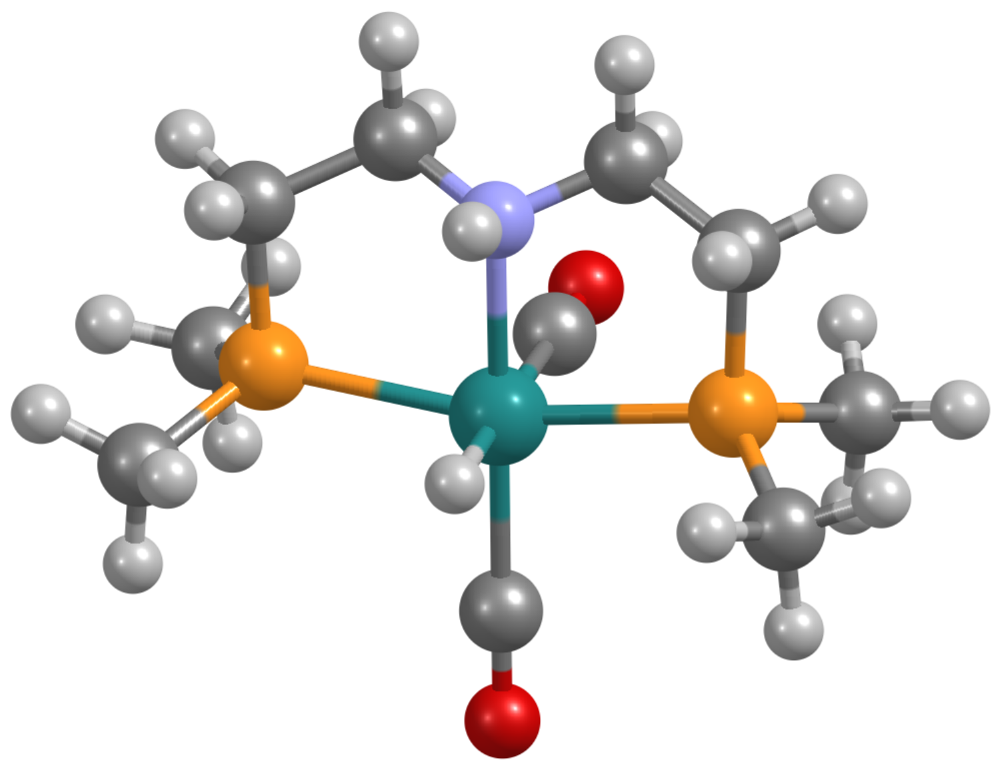
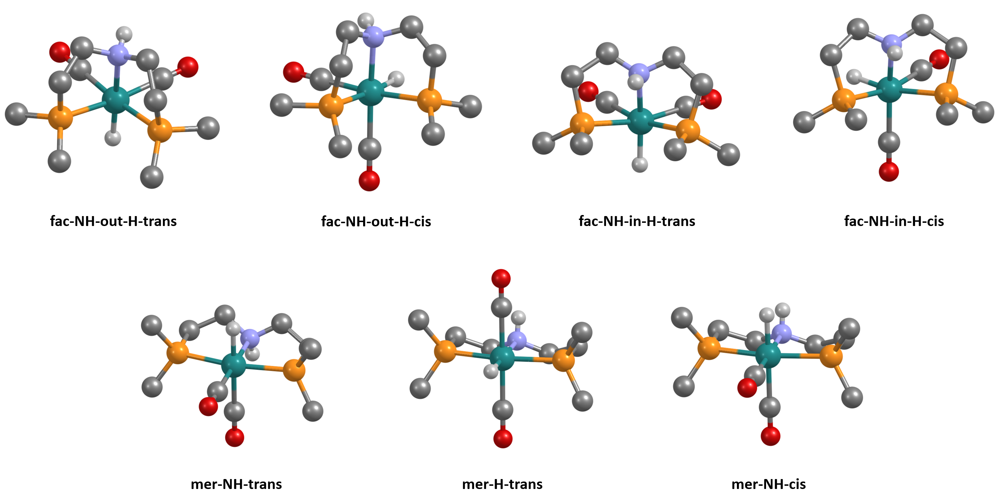

# MACE: MetAl Complexes Embedding

Python library and command-line tool for generation of 3D coordinates for complexes of d-/f-elements.

## Installation

Create new conda environment with [RDKit](http://anaconda.org/rdkit/rdkit) 2020.03.1 or later:

```
> conda create -n mace
> conda install -c rdkit rdkit=2020.09.1
```

Next activate the environment install mace package using pip:

```
> conda activate mace
> pip install mace=0.2
```

## Short How-To

This section briefly describes the main possibilities of the package. For more details and usage cases see the [manual](manual/manual.md) (under development).

### Generate 3D coordinates for the complex

First, you need to initialize the complex. The easiest way to do it is to draw the complex in Marvin Sketch and copy its ChemAxon SMILES:



Bonds between donor atoms and the central ion must be encoded as dative bonds. Atomic map numbers (blue numbers close to donor atoms) are used to describe the spatial arrangement of ligands.

After copying SMILES, initialize the Complex object:

```python
import mace

# copied SMILES
smiles = '[Ru++]12([H-:3])([C-:5]#[O+])([C-:6]#[O+])[NH:1](CC[P:4]1(C)C)CC[P:2]2(C)C |C:9.9,14.15,6.5,1.0,2.1,4.3|'
geom = 'OH' # OH - octahedral, SP - square planar
X = mace.Complex(smiles, geom)
X.mol
```



To generate atomic coordinates, use `AddConformer` or `AddConformers` methods:

```python
conf_idxs = X.AddConformers(numConfs = 5)
X.ToXYZ('test.xyz', confId = 'all')
```

Here's the result:



### Search of stereomers

In homogeneous catalysis you do not know structure of the complex *a priori*. Thus, you need to analyze all possible stereomers. For the purpose, first initialize complex, and this time let's do it from ligands:

```python
import mace

# SMILES of ligands copied from Marvin Sketch
# donor atoms must have any non-zero map number
ligands = ['C[P:1](C)CC[NH:1]CC[P:1](C)C', '[H-:1]', '[C-:1]#[O+]', '[C-:1]#[O+]']
CA = '[Ru+2]' # SMILES of central atom
geom = 'OH'
X = mace.ComplexFromLigands(ligands, CA, geom)
```

You can not generate atomic coordinates for this complex as it contains incorrect information on the spatial arrangement of ligands (all donor atoms are in the first position):

```python
X.AddConformer()
##> Bad SMILES: isotopic labels are not unique
##> 
##> The initial SMILES contains insufficient or erroneous info
##> on the positions of the ligands around the central atom
##> encoded with isotopic labels.
##> To use 3D generation and other features, generate
##> possible stereomers using GetStereomers method.
print(X.GetNumConformers())
##> 0
```

Next, let's find all possible stereomers:

```python
Xs = X.GetStereomers(regime = 'all', dropEnantiomers = False)
print(len(Xs))
##> 9
Xs = X.GetStereomers(regime = 'all', dropEnantiomers = True)
print(len(Xs))
##> 7
```

So, this complex has 7 stereomers, and 2 of them are enantiomeric. Let's generate atomic coordinates for them and save to XYZ-files:

```python
for i, X in enumerate(Xs):
    X.AddConformers(numConfs = 5)
    X.ToXYZ(f'X1_{i}.xyz', confId = 'min')
```

Here's the result (aliphatic hydrogens removed for clarity):




### Introduction of substituents

...