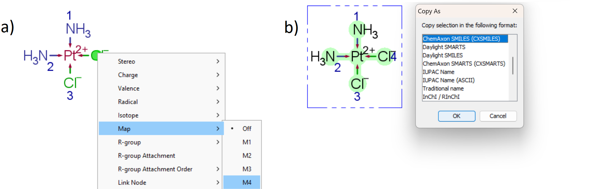

Getting SMILES
==============

.. warning::
    This section is crucial for understanding how to get the input for any program that uses **mace**,
    be it a python library, a CLI tool, or a GUI program.

The main problem that the **mace** package solves is a stereomer search and generation of 3D atomic coordinates
for mononuclear octahedral and square-planar metal complexes. Thus, any program that uses the **mace** package
must receive the structure of the complex or the corresponding ligands as input. **mace** uses the `SMILES`_ notation
to describe structure of input molecules, or rather two versions: `RDKit SMILES extension`_ and `ChemAxon SMILES`_.
The reason is that these are fairly popular SMILES formats that support dative bonds used in `mace` to describe metal-ligand bonds.

For those who is familiar with the practical side of chemoinformatics, getting SMILES will not be a problem.
For others the easiest way is to use the [ChemAxon Marvin](https://chemaxon.com/marvin) chemical editor.

Start with drawing the complex.

.. note::
    
    1. Bonds between central (`CA`) and donor (`DA`) atoms are dative, directed from `DA` to `CA`;
    
    2. The complex contains one central atom only;
    
    3. Donor atoms of ligands have non-zero atom map numbers. Other atoms have unspecified map and isotope numbers, unless it's dummy atoms describing substituents (see the `Adding substituents` section in Tutorial);
    
    4. Map numbers of `DAs` are used to describe their spatial arrangement around a central atom:
    
    .. image:: images/geoms_scheme.png

To set map numbers, right click on the atom and select **map** option. To save the structure in SMILES format, select the molecule,
right click on it and select **Save as**. Use ChemAxon SMILES for metal complexes and Daylight SMILES for ligands:

Now the SMILES is copied to the clipboard and can be pasted via the **Ctrl+V** keyboard shortcut.

.. _SMILES: https://www.daylight.com/dayhtml/doc/theory/theory.smiles.html
.. _RDKit SMILES extension: https://www.rdkit.org/docs/RDKit_Book.html#smiles-support-and-extensions
.. _ChemAxon SMILES: https://docs.chemaxon.com/display/docs/smiles.md

