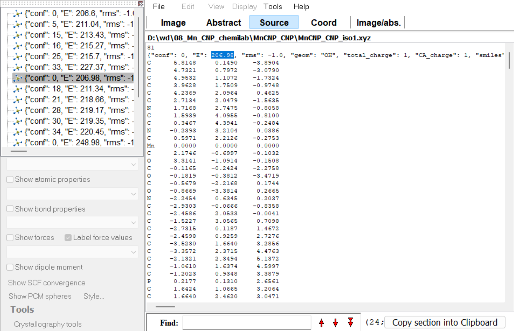

Viewing structures
==================

Visualizing SMILES
------------------

Daylight and ChemAxon SMILES can be visualized by :kbd:`Ctrl+C` / :kbd:`Ctrl+V` of a smiles string to the window of `ChemAxon Marvin`_ editor. RDKit SMILES containing dative bonds ("->" & "<-") can be vizualized by `RDKit <https://www.rdkit.org/docs/Cookbook.html#drawing-molecules-jupyter>`_ only.

Viewing xyz-files
-----------------

We believe that the most convenient way to visualize **epic-mace**'s output xyz-files is to use the `ChemCraft`_ molecular editor. This section shows how to use it for visualization and analysis of generated structures.

The main output of **epic-mace** are xyz-files organized so that:
  
  - directories correspond to different ligand-metal systems;
  
  - directories contains xyz-files corresponding to the distinct stereomers;
  
  - xyz-files may contain several conformers with their properties (we are primarily interested in a molecular-mechanical energy) specified in a comment line of each molecular block.

To analyze conformers of the stereomer, open the corresponding file. If there are more than one structure, you will see list of the available conformers in the left part of the window:

To view several stereomers, use the :guilabel:`File > Open multiple files` option and select required xyz-files. If conformers were ordered by energy before saving the xyz-files, you can easily see the boundaries between different stereomers:

To understand which isomer corresponds to the current structure, open the :guilabel:`Source` tab and look at the file name. This tab can also be useful for viewing energy, which is not displayed in the main tab for files containing one structure.

.. _ChemAxon Marvin: https://chemaxon.com/marvin
.. _ChemCraft: https://www.chemcraftprog.com/

